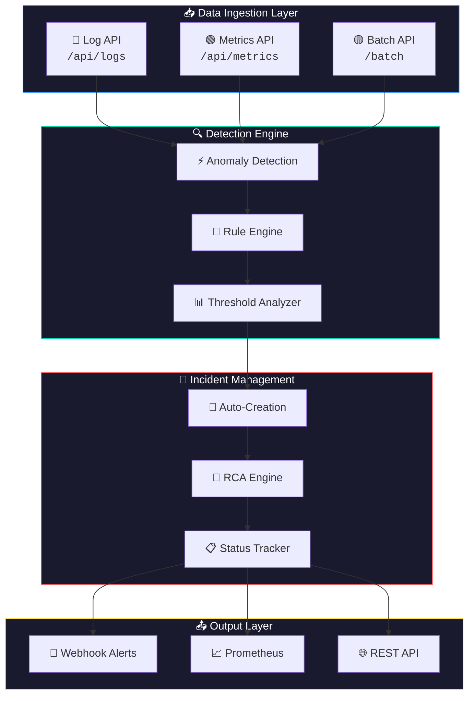
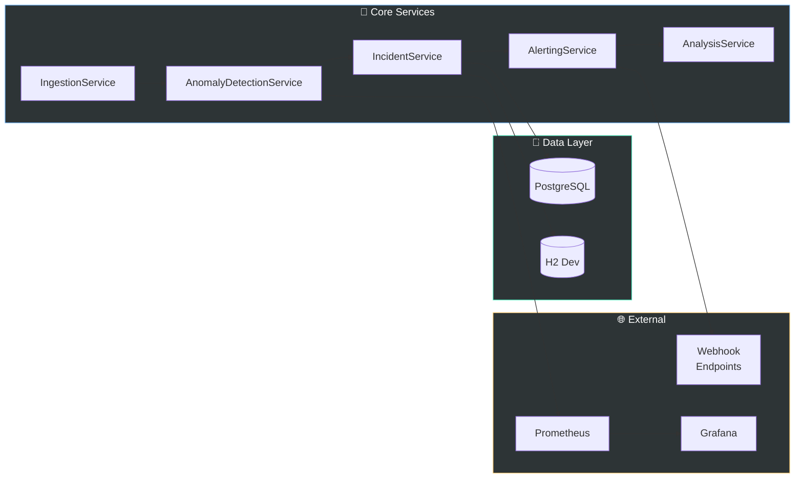
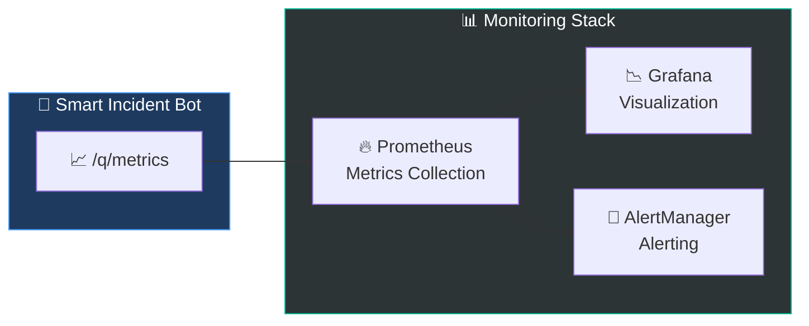

<div align="center">

# 🤖 Smart Incident Bot


### **Intelligent Cloud-Native Incident Detection & Diagnosis System**

> *Automatically detect, analyze, and alert your DevOps/SRE teams about infrastructure anomalies before they become critical incidents.*

<br>


---

[**🚀 Quick Start**](#-quick-start) • [**📡 API Reference**](#-api-reference) • [**🐳 Deployment**](#-kubernetes-deployment) • [**📊 Monitoring**](#-monitoring-stack)

</div>

---

## ✨ Key Features

<table>
<tr>
<td width="50%" valign="top">

### 📥 Data Ingestion
- **Log Collection** — Accept structured logs via REST API
- **Metrics Pipeline** — CPU, memory, latency, error rates
- **Batch Processing** — High-throughput bulk ingestion

### 🔍 Intelligent Detection
- **Anomaly Detection** — Rule-based with configurable thresholds
- **Pattern Recognition** — Error rate & latency spike detection
- **Resource Monitoring** — CPU/Memory threshold alerts

</td>
<td width="50%" valign="top">

### 🎯 Incident Management
- **Auto-Creation** — Automatic incident creation on anomalies
- **Root Cause Analysis** — Correlate incidents to probable causes
- **Status Tracking** — Full lifecycle management

### 🔔 Alerting & Integration
- **Webhook Alerts** — Send structured alerts externally
- **Prometheus Metrics** — Built-in observability
- **Health Checks** — Kubernetes-native health probes

</td>
</tr>
</table>

---

## 🏗️ System Architecture



---

## 🧩 Component Overview



---

## 🚀 Quick Start

### Prerequisites

<div align="center">

| Requirement | Version | Purpose |
|:-----------:|:-------:|:-------:|
| ☕ **Java** | 17+ | Runtime environment |
| 📦 **Maven** | 3.8+ | Build automation |
| 🐳 **Docker** | Latest | Containerization (optional) |
| ☸️ **kubectl** | Latest | K8s deployment (optional) |

</div>

### ⚡ Development Mode

```bash
# Clone and navigate
git clone https://github.com/your-org/smart-incident-bot.git
cd smart-incident-bot

# Start in dev mode with hot reload
./mvnw quarkus:dev
```

> 🌐 Application available at **http://localhost:8080**  
> 📊 Dev UI available at **http://localhost:8080/q/dev**

### 🐳 Docker Deployment

```bash
# Build the container image
docker build -t smart-incident-bot:latest .

# Run with default settings
docker run -p 8080:8080 smart-incident-bot:latest

# Run with custom configuration
docker run -p 8080:8080 \
  -e APP_SECURITY_API_TOKEN=your-secure-token \
  -e APP_ALERTING_WEBHOOK_URL=http://your-webhook/alerts \
  smart-incident-bot:latest
```

---

## 📡 API Reference

### 🔐 Authentication

All API endpoints require the `X-API-Token` header:

```bash
curl -H "X-API-Token: demo-token-change-in-production" ...
```

### 🔌 Endpoints

<details>
<summary><b>📥 Log Ingestion</b></summary>

#### `POST /api/logs` — Ingest single log entry

```json
{
  "level": "ERROR",
  "message": "Connection timeout to database after 30s",
  "serviceName": "payment-service",
  "podName": "payment-service-pod-1"
}
```

#### `POST /api/logs/batch` — Bulk log ingestion

```json
[
  {"level": "ERROR", "message": "Error 1", "serviceName": "svc-1"},
  {"level": "WARN", "message": "Warning 1", "serviceName": "svc-2"}
]
```

</details>

<details>
<summary><b>📊 Metrics Ingestion</b></summary>

#### `POST /api/metrics` — Ingest single metric

```json
{
  "metricName": "cpu_usage_percent",
  "value": 95.5,
  "serviceName": "order-service",
  "podName": "order-service-pod-1",
  "unit": "percent"
}
```

#### `POST /api/metrics/batch` — Bulk metrics ingestion

```json
[
  {"metricName": "http_5xx_count", "value": 45, "serviceName": "api-gateway"},
  {"metricName": "http_total_count", "value": 500, "serviceName": "api-gateway"},
  {"metricName": "memory_usage_percent", "value": 88.5, "serviceName": "api-gateway"}
]
```

</details>

<details>
<summary><b>🎯 Incident Management</b></summary>

#### `GET /api/incidents` — List all incidents
#### `GET /api/incidents/open` — List open incidents only
#### `GET /api/incidents/{id}` — Get incident by ID
#### `GET /api/incidents/stats` — Get incident statistics

#### `PATCH /api/incidents/{id}/status` — Update incident status

```json
{
  "status": "RESOLVED",
  "resolvedBy": "john.doe@company.com",
  "resolutionNotes": "Increased connection pool size"
}
```

</details>

<details>
<summary><b>🩺 Health & Metrics</b></summary>

#### `GET /q/health` — Kubernetes health check
#### `GET /q/health/live` — Liveness probe
#### `GET /q/health/ready` — Readiness probe
#### `GET /q/metrics` — Prometheus metrics endpoint

</details>

---

## ⚙️ Configuration

### 🎚️ Detection Thresholds

```yaml
# application.properties
app.detection.error-rate-threshold=5.0        # Error rate % to trigger
app.detection.latency-threshold-ms=2000       # Latency threshold in ms
app.detection.cpu-threshold-percent=90.0      # CPU usage threshold %
app.detection.memory-threshold-percent=85.0   # Memory threshold %
app.detection.pod-restart-threshold=3         # Pod restarts in 10 min
app.detection.check-interval-seconds=30       # Detection check interval
```

### 🔧 Environment Variables

```bash
# 🗄️ Database Configuration (Production)
POSTGRES_URL=jdbc:postgresql://host:5432/incidentdb
POSTGRES_USER=incident_user
POSTGRES_PASSWORD=secure_password

# 🔐 Security
APP_SECURITY_API_TOKEN=your_secure_token

# 🔔 Alerting
APP_ALERTING_WEBHOOK_URL=http://your-webhook-endpoint/alerts
APP_ALERTING_ENABLED=true
```

---

## ☸️ Kubernetes Deployment

### 🚀 Deploy to Kubernetes/AKS

```bash
# 1️⃣ Create namespace
kubectl create namespace incident-bot

# 2️⃣ Apply secrets (update with real values first!)
kubectl apply -f k8s/secret.yaml -n incident-bot

# 3️⃣ Apply configuration
kubectl apply -f k8s/configmap.yaml -n incident-bot

# 4️⃣ Deploy application
kubectl apply -f k8s/deployment.yaml -n incident-bot
```

### ✅ Verify Deployment

```bash
# Check pods status
kubectl get pods -n incident-bot -w

# Check services
kubectl get svc -n incident-bot

# View application logs
kubectl logs -l app=smart-incident-bot -n incident-bot --tail=100 -f

# Test health endpoint
kubectl port-forward svc/smart-incident-bot 8080:8080 -n incident-bot
curl http://localhost:8080/q/health
```

---

## 📊 Monitoring Stack

The project includes a complete **Prometheus + Grafana** monitoring stack:



### 🛠️ Deploy Monitoring

```bash
# Deploy complete monitoring stack
cd k8s/monitoring
chmod +x deploy-monitoring.sh
./deploy-monitoring.sh

# Access Grafana dashboard
kubectl port-forward svc/grafana 3000:3000 -n monitoring
# Open: http://localhost:3000 (admin/admin)

# Access Prometheus
kubectl port-forward svc/prometheus 9090:9090 -n monitoring
# Open: http://localhost:9090
```

### 📈 Available Dashboards

- **Application Overview** — Request rates, latencies, error rates
- **JVM Metrics** — Heap usage, GC stats, thread counts
- **Incident Dashboard** — Incident counts, resolution times

---

## 🛠️ Development

### 📁 Project Structure

```
smart-incident-bot/
├── 📂 src/main/java/com/smartincident/
│   ├── 📁 model/          # 💾 Entities (Incident, LogEntry, Metric)
│   ├── 📁 dto/            # 📦 Data Transfer Objects
│   ├── 📁 repository/     # 🗄️ Panache Repositories
│   ├── 📁 service/        # ⚙️ Business Logic Services
│   │   ├── IngestionService.java
│   │   ├── AnomalyDetectionService.java
│   │   ├── IncidentService.java
│   │   ├── AlertingService.java
│   │   └── AnalysisService.java
│   ├── 📁 resource/       # 🌐 REST Endpoints
│   ├── 📁 security/       # 🔐 Authentication
│   └── 📁 scheduler/      # ⏰ Scheduled Tasks
├── 📂 src/main/resources/
│   ├── application.properties
│   └── import.sql
├── 📂 k8s/                # ☸️ Kubernetes Manifests
│   ├── deployment.yaml
│   ├── configmap.yaml
│   ├── secret.yaml
│   └── 📁 monitoring/     # 📊 Prometheus & Grafana
├── 🐳 Dockerfile
└── 📦 pom.xml
```

### 🧪 Testing

```bash
# Run unit tests
./mvnw test

# Run integration tests
./mvnw verify

# Run tests with coverage
./mvnw test -Dquarkus.jacoco.enabled=true
```

### 📦 Building

```bash
# Build JAR package
./mvnw package

# Build native executable (requires GraalVM)
./mvnw package -Pnative

# Build container image
./mvnw package -Dquarkus.container-image.build=true
```

---

## 🔒 Security Features

<div align="center">

| Feature | Description |
|:-------:|:-----------:|
| 🔑 **Token Auth** | API token-based authentication |
| 🛡️ **Non-root Container** | Runs as non-privileged user |
| 🔐 **K8s Secrets** | Sensitive data in Kubernetes secrets |
| 🌐 **CORS Support** | Configurable CORS policies |
| 📝 **Audit Logging** | Request/response logging |

</div>

---

## 🤝 Contributing

We welcome contributions! Here's how you can help:


1. **Fork** the repository
2. **Create** a feature branch (`git checkout -b feature/amazing-feature`)
3. **Commit** your changes (`git commit -m 'Add amazing feature'`)
4. **Push** to the branch (`git push origin feature/amazing-feature`)
5. **Open** a Pull Request

---

## 📄 License

<div align="center">

This project is licensed under the **MIT License** — see the [LICENSE](LICENSE) file for details.

---

<br>

**Built with ❤️ using**


<br><br>

*Supersonic Subatomic Java*

---

<sub>© 2024 Smart Incident Bot Team</sub>

</div>
